# VORTREXYN — Premium Car Rental System

A full-stack multi-page web application for a premium car rental service. Users can browse vehicles, make reservations, and pay online. An admin dashboard allows staff to manage bookings, fleet stock, and custom vehicles with AI-generated images.

---

## Screenshots

### Login
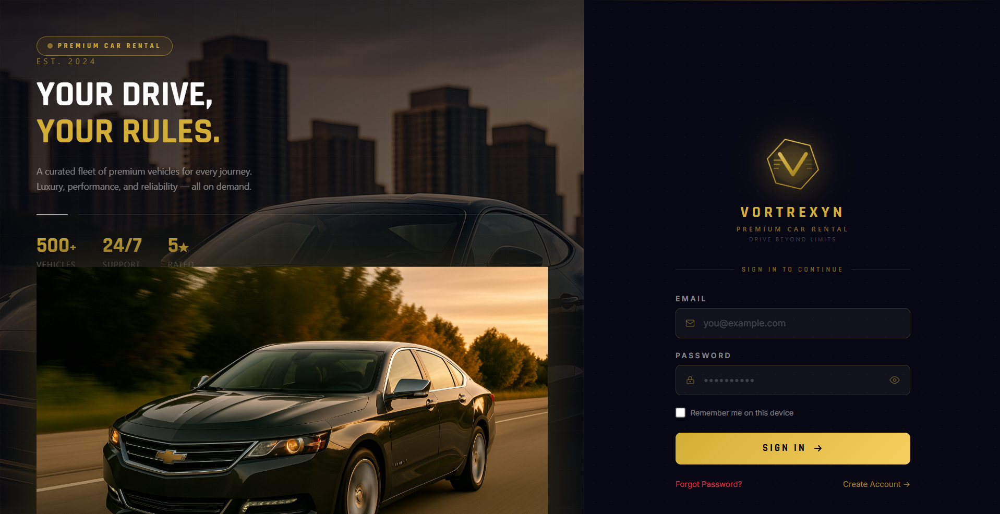

### Sign Up
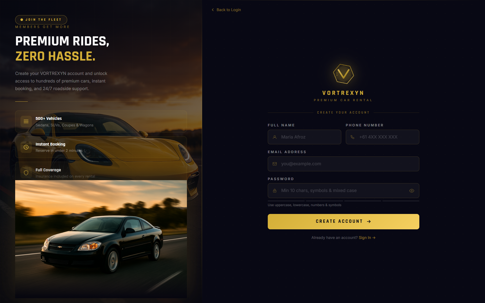

### Forgot Password
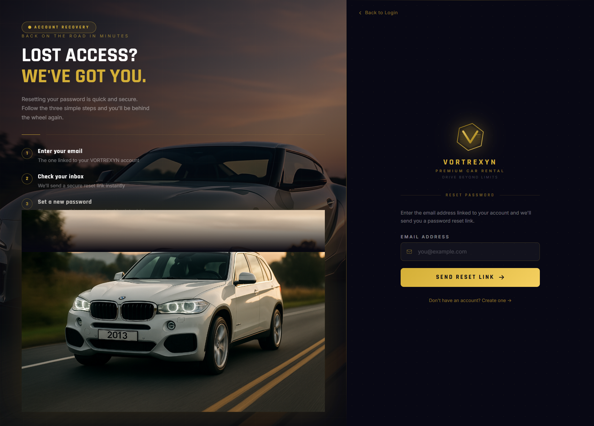

### Home — Fleet Browse
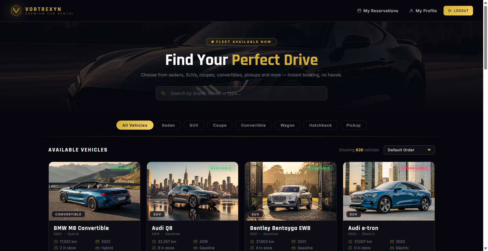

### Reservations — Booking Form
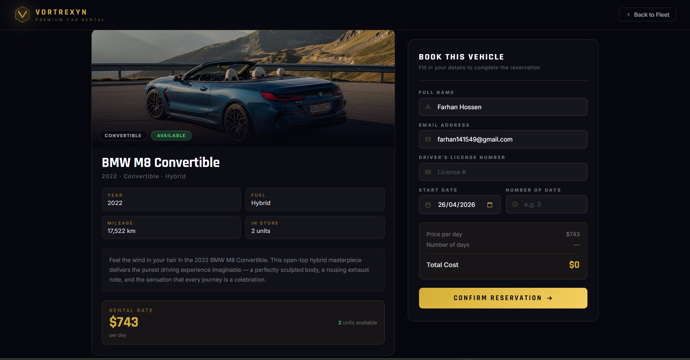

### Order Confirmation
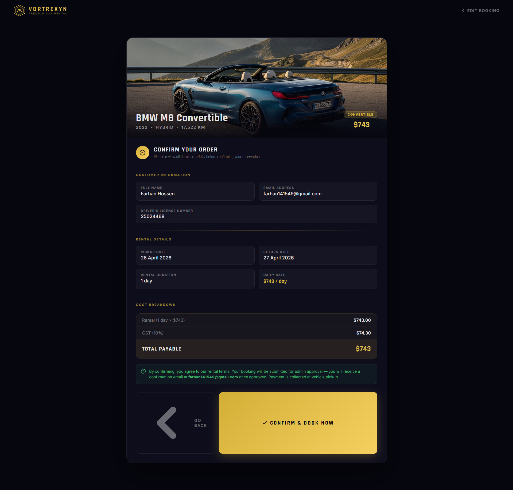

### My Reservations
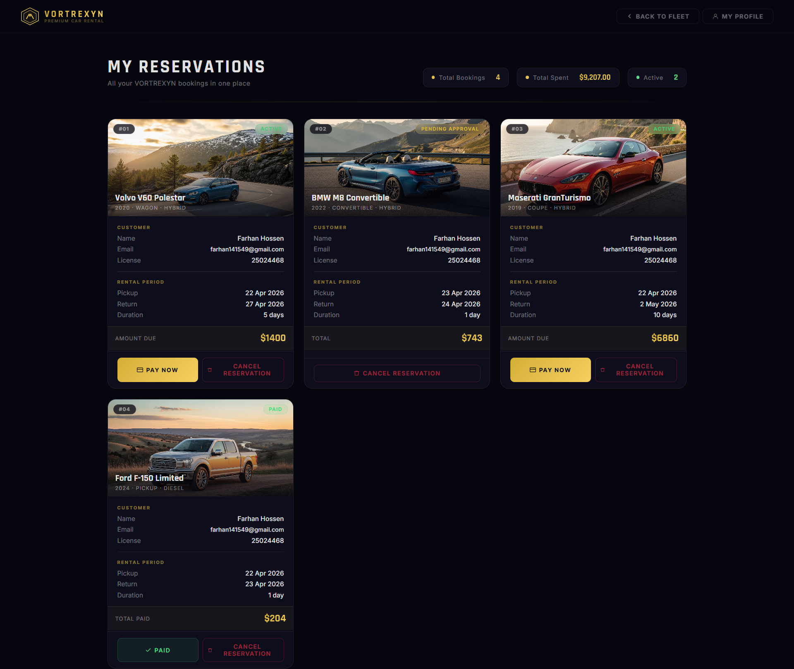

### Profile
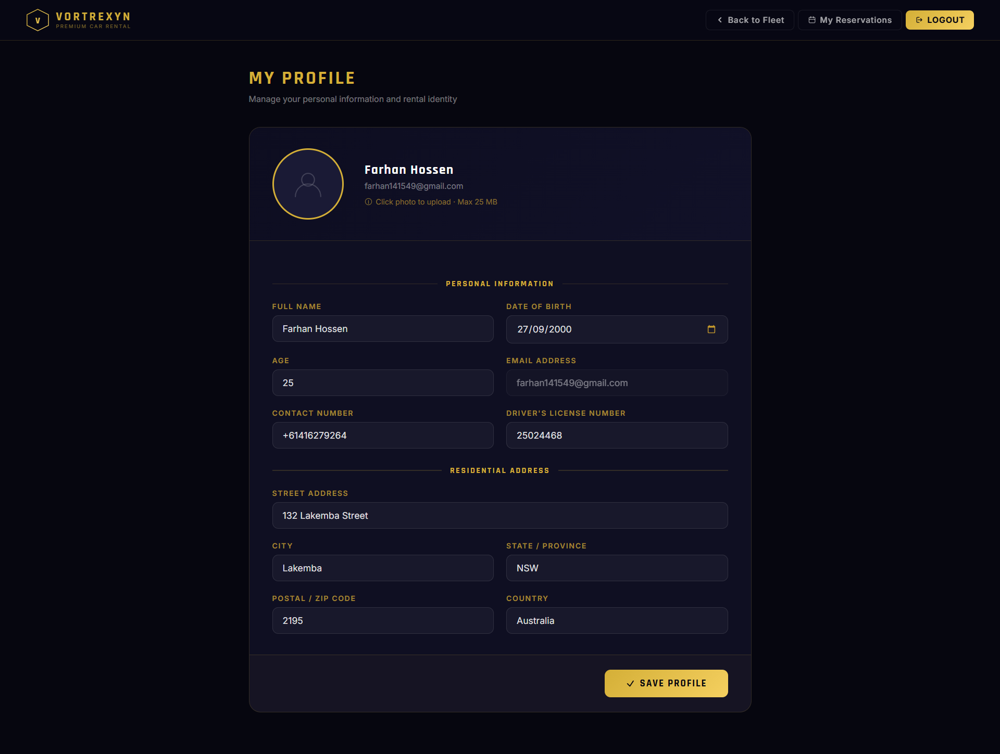

### Admin — Overview
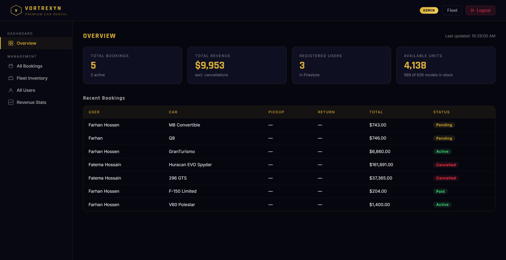

### Admin — All Bookings
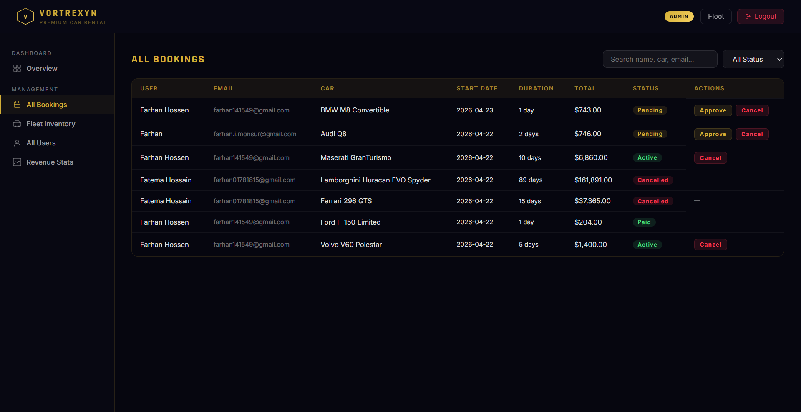

### Admin — Fleet Inventory
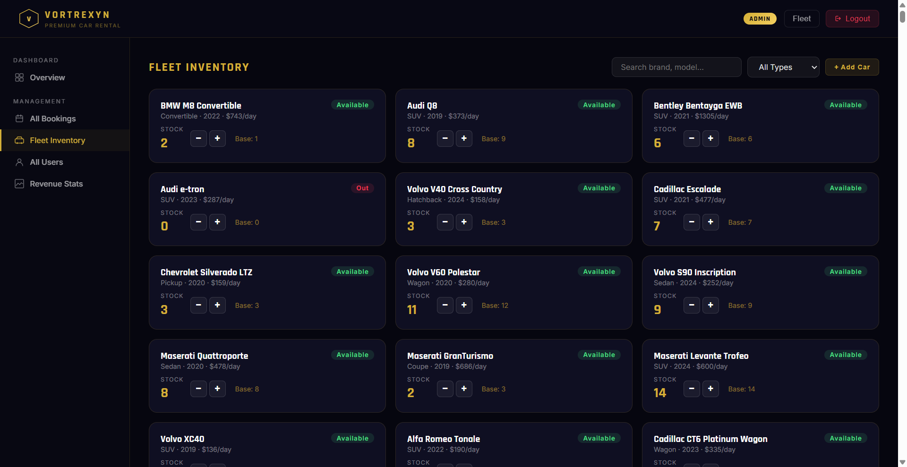

### Admin — All Users
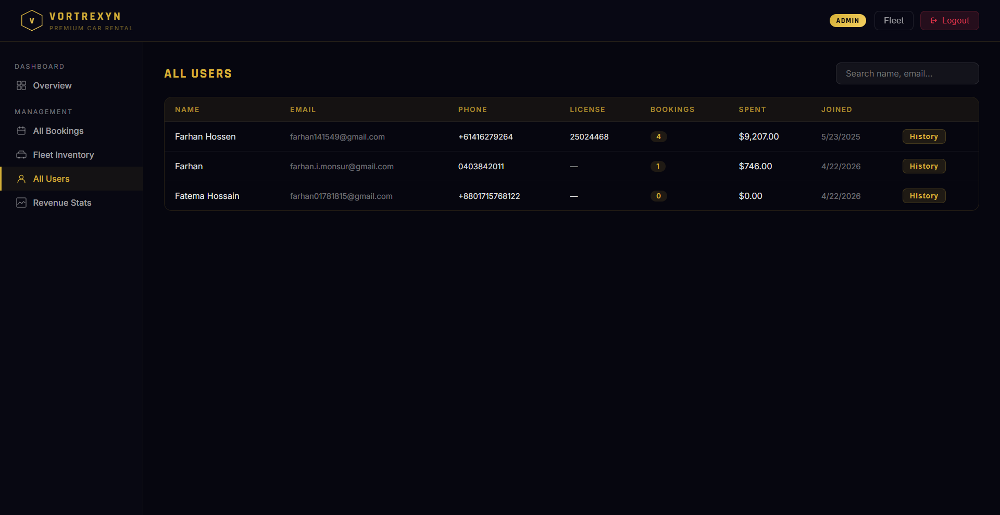

### Admin — Revenue Stats
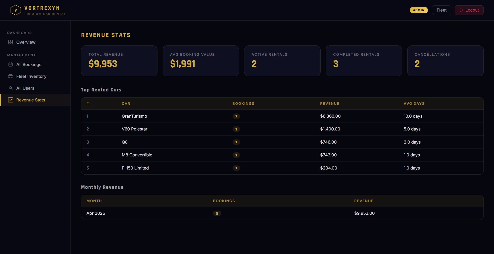

### Admin — Add Vehicle (AI)
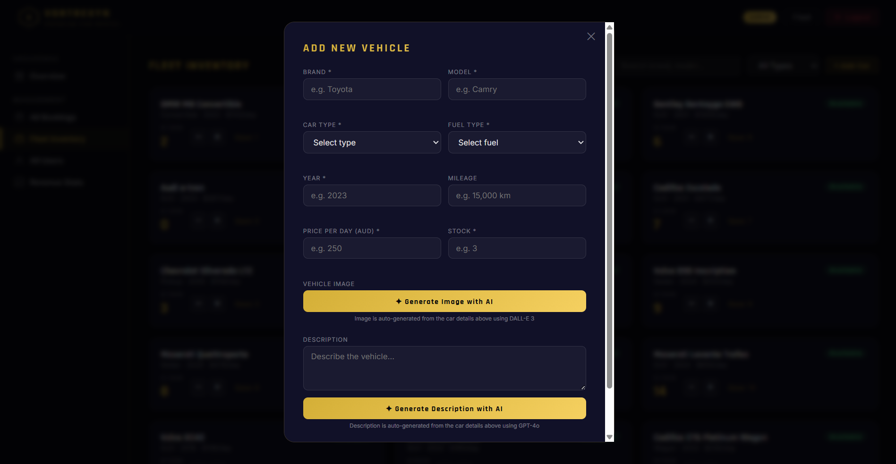

---

## Tech Stack

- **Frontend:** Vanilla HTML5 / JavaScript / CSS
- **Styling:** Tailwind CSS (CDN)
- **Auth & DB:** Firebase v9 Compat — email/password auth + Firestore
- **Email:** EmailJS (booking confirmation + cancellation)
- **Payments:** PayPal Live SDK (AUD)
- **AI Images:** OpenAI DALL-E 3 (admin fleet management)
- **Server:** Node.js + Express (static file serving + image generation proxy)
- **Data:** Local JSON (`data/cars.json`) for catalog; all user data in Firestore

## Project Structure

```
/
├── index.html                    # Entry point — Login page
├── server.js                     # Express server (static serving + DALL-E proxy)
├── firestore.rules               # Firestore security rules
├── public/
│   ├── home.html                 # Car listing / search dashboard
│   ├── reservations.html         # Car detail + booking form
│   ├── orderConfirmation.html    # Booking confirmation (writes to Firestore)
│   ├── myReservations.html       # User reservation history + PayPal payment
│   ├── profile.html              # User profile (photo stored as base64)
│   ├── admin.html                # Admin dashboard (bookings, fleet, users, revenue)
│   ├── signup.html               # Registration
│   └── forgot.html               # Password reset
├── assets/                       # Images (car photos, backgrounds, logo)
├── screenshots/                  # Page screenshots for documentation
├── data/
│   └── cars.json                 # 625-car catalog
└── package.json
```

## Firestore Collections

| Collection | Purpose |
|---|---|
| `users/{uid}` | User profile (name, contact, license, photo base64) |
| `pendingOrders/{uid}` | Transient booking in progress (cleared after confirmation) |
| `orders` | All confirmed bookings (`userId` field for per-user filtering) |
| `fleetOverrides/overrides` | Single doc `{vin: stockCount}` — overrides cars.json inStore |
| `customCars` | Admin-added vehicles with AI-generated images |

## Booking Flow

1. **home.html** — user picks a car → navigates to `reservations.html#VIN`
2. **reservations.html** — form pre-filled from `users/{uid}`; saves to `pendingOrders/{uid}`
3. **orderConfirmation.html** — loads from `pendingOrders/{uid}`; writes to `orders`, decrements `fleetOverrides`, deletes pending, sends EmailJS confirmation
4. **myReservations.html** — queries `orders` by userId; admin approves → user pays via PayPal → status becomes `paid`; cancel = mark cancelled + restore stock + send email

## Environment Variables

| Variable | Purpose |
|---|---|
| `OPENAI_API_KEY` | OpenAI API key for DALL-E 3 image generation |

## Firebase Configuration

- **Project:** `vortrexyn-car-rental-system`
- **Admin account:** `vortrexyn.madmax@gmail.com`
- Auth type: email/password

## EmailJS Configuration

- **Service:** `service_29gwayk`
- **Approval template:** `template_p5tesbb`
- **Cancellation template:** `template_ho59umh`
- **Public key:** `T_E3Q6Fu5wJ5OmOMd`

## Running Locally

```bash
npm install
npm start
```

Serves on port 5000.

## Important Manual Steps

- Publish `firestore.rules` via **Firebase Console → Firestore → Rules** after any rules changes
- The `orders` + `userId` + `createdAt` composite Firestore index: Firebase will surface a link in the browser console on first query — click it to auto-create
